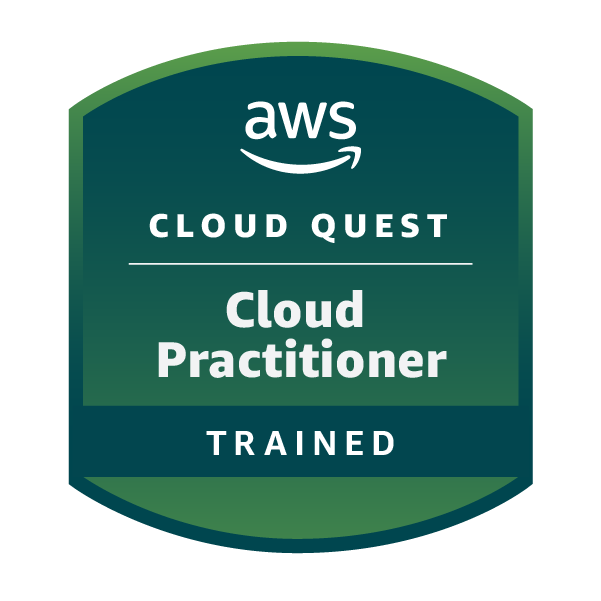

<h1 align="center">Hi 👋, I'm Perumal</h1>

<h3 align="center">
DevOps Engineer | Java Developer | Kubernetes | Cloud Native | DevSecOps
</h3>

---

# 🚀 About Me

- 🔧 DevOps Engineer with **1.5+ years of experience**
- ☸️ Working on **containerizing legacy .NET Framework applications**
- 🚀 Deploying workloads on **Kubernetes / OpenShift**
- 📦 Passionate about **Cloud Native Platforms & Platform Engineering**
- 📊 Interested in **Observability, DevSecOps, and Infrastructure Automation**
- ☕ Interested in **Java backend development**

### Java Interests

- Spring Boot
- Spring Security
- Microservices Architecture
- Apache Kafka
- MySQL
- MongoDB

---

## 🏅 Certifications & Badges

<table align="center">
<tr>
<td align="center">

 

**Oracle Java Foundations**  
Oracle Learning Explorer

</td>

<td align="center">

 

**AWS Cloud Quest**  
Cloud Practitioner

</td>

</tr>
</table>

---

# 🛠 Technologies & Tools

## ☸️ Containerization

---

## ⚙️ CI/CD

---

## 🏗 Infrastructure as Code

---

## 📊 Observability

---

## ☁️ Cloud

---

## 🔐 Security / DevSecOps

---

## 💻 Programming

-ED8B00?style=for-the-badge&logo=openjdk&logoColor=white)

---

# 📊 GitHub Dashboard

---

# 🤝 Connect With Me

📧 Email  
**perumal180402@gmail.com**

💼 LinkedIn  
https://www.linkedin.com/in/perumal-s-133481251/

🌐 GitHub  
https://github.com/Perumal05

---

⭐ *Interested in Kubernetes, DevSecOps, Java microservices, and building modern cloud-native platforms.*
